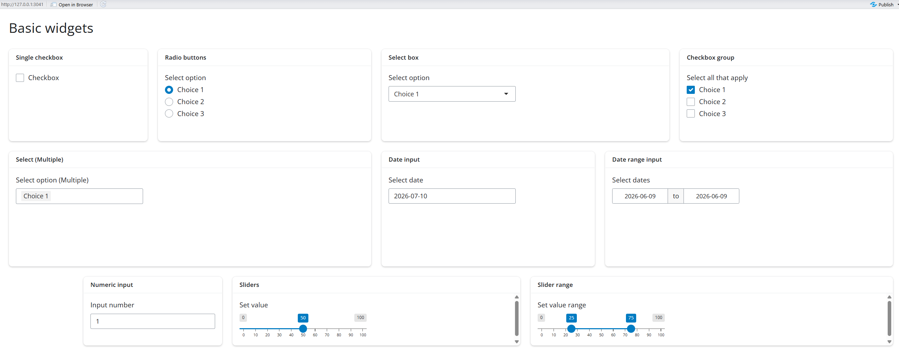

# 1. Introductions and Scene Setting

------------------------------------------------------------------------

## 1.1 Welcome {.smaller}

-   **Rory Chen, MSc** 
-   **Ana W. Capuano, PhD** 
-   **Sarah Bauermeister, PhD** 
-   **Graham Bearden, PhD** 
-   **Ashleigh Vella, PhD** 
-   **James Lian, PhD** 

------------------------------------------------------------------------

## 1.2 Today's agenda {.smaller}

The workshop will run for 4 hours, 1-5 pm.

-   1:00 - 1:30 p.m. - Introductions and Scene Setting

-   1:30 - 2:00 p.m. - Theory and Real-World App Demo

-   2:00 - 3:00 p.m. - Guided Practice: Build Your First Shiny App

-   3:00 - 3:30 p.m. - Break

-   3:30 - 4:30 p.m. - Independent Hands-On Exercise

-   4:30 - 5:00 p.m. - Group Sharing and Wrap-Up

------------------------------------------------------------------------

## 1.3 Why use `shiny` for your research {.smaller}

-   `Shiny` is an R package that makes it easy to build `interactive` web applications (apps) straight from R. .

-   `Integration with R`: R users can build web applications without HTML/CSS/JS knowledge and leverage the full power of R's data manipulation and visualization capabilities.

-   `Accessibility`: Shiny apps can be easily shared via URLs, making research findings more accessible to a wider audience.

-   `Engagement`: Interactive visualizations and user interfaces can enhance engagement, great for presentations, teaching, collaboration and more

-   `Customization`: Shiny offers extensive customization options, enabling researchers to tailor their applications to specific research questions and audiences.

... and more!

------------------------------------------------------------------------

## 1.4 Learning Objectives {.smaller}

By the end of this workshop, you will be able to:

-   Understand the fundamental concepts and features of `shiny` package.
-   Create an interactive and dynamic `shiny` dashboard following a guided, step-by-step coding exercise.
-   Design reproducible and salable `shiny` modules using structured development practices.
-   Independently apply `shiny` to present own scientific outputs in an engaging, accessible format.
-   Test the integration of large language models (LLMs) into Shiny applications using the `ellmer` and `querychat` package.

------------------------------------------------------------------------

## 1.5 Setup

-   You are comfortable coding in R and R Studio
-   No prior knowledge of Shiny apps required.
-   Access Github: <https://github.com/RoryChenXY/aaic2026-shiny-research> 
-   Install the required package if you haven't already
-   Access your Anthropic key and and save it to .Renviron
-   If you have any troubles, please raise your hand, one of the facilitators will come to assist you.

------------------------------------------------------------------------

###  1.5.1 Setup - Projects

-   In R Studio, go to "File" -> "New Project" (left top corner)
-   Choose "New Directory"  -> "New Project"
-   Choose location and enter `Directory name` (e.g. "aaic2026-shiny-research")
-   Put all the downloaded files in the new project directory


------------------------------------------------------------------------

###  1.5.2 Setup - Packages

-    Open `setup.R` and run the code to install the required packages for the workshop.

```{r}
#| echo: true
#| eval: false

pkglist <- c( "shiny","bslib", # basic shiny pkgs
              "ggplot2","plotly","sf","leaflet", # interactive plots
              "here", "usethis","dplyr", # data manipulation and project management
              "DT","gt","gtsummary", # interactive tables and summary tables
              "modeldata", # sample data
              "ellmer","shinychat","querychat") # LLM integration

# install packages if not already installed
new.packages <- pkglist[!(pkglist %in% installed.packages()[,"Package"])]
if(length(new.packages)) install.packages(new.packages)

```

------------------------------------------------------------------------

###  1.5.3 Setup - API keys

-   Restart R Studio to make sure the API keys are loaded. 
-   You can check if the key is loaded by running `Sys.getenv("ANTHROPIC_KEY")` in the console. 
-   It should return your API key.

```{r}
#| echo: true
#| eval: false
# Use this to add your API keys to your .Renviron file at the workshop.
# API key will be distributed at the workshop and disabled after. 
# Do not share your API key with anyone else.
usethis::edit_r_environ()
```


# 2. Theory and Basics {.smaller}

## 2.1 Anatomy of a Shiny app {.smaller}

**Shiny** is an R package that makes it easy to build interactive web applications (apps) straight from R. 

Usually, a Shiny app consists of 3 main components:

-   **UI (User Interface):** How your app looks
-   **Server:** How your app works
-   **Shiny app object:** a call to `shinyApp(ui=ui, server=server)` function that put ui and server components together to create the shiny app.

------------------------------------------------------------------------

### 2.1.1 Hello, World! {.smaller}

-   Open and run `01-helloworld.R`
-   This is the most basic Shiny app you can create. 

```{r}
#| echo: true
#| eval: false
library(shiny)
library(bslib)
# UI -----
ui <- bslib::page_fluid(
  h1("Hello, World!")
)
# Server -----
server <- function(input, output, session) {
}
# Run the app -----
shinyApp(ui = ui, server = server)
```


------------------------------------------------------------------------

### 2.1.1 Hello, World! {.small-contd} 


------------------------------------------------------------------------

### 2.1.2 Hello, Name! {.smaller}

-   Open and run `02-helloname.R`
-   Inside the ui we define:
    -   `textInput`
    -   `textOutput`
-   Define the output in server function - it is wrapped in a call to `renderText` to indicate that:
    -   It is `"reactive"` and therefore should be automatically re-executed when inputs (`input$name`) change
    -   Its output type is a text
    
------------------------------------------------------------------------
           
### 2.1.2 Hello, Name! {.small-contd} 

```{r}
#| echo: true
#| eval: false
#| code-line-numbers: "6-8|12-14"

library(shiny)
library(bslib)
# UI -----
ui <- bslib::page_fluid(
  h1("Hello, World!"),
  textInput(inputId = 'name',
            label = 'Your Name:'),
  textOutput('greeting')
)
# Server -----
server <- function(input, output, session) {
  output$greeting <- renderText({
    paste('Hello, ', input$name, "!", sep = '')
  }) 
}  
```

---------------------------------------------------------
           
### 2.1.2 Hello, Name! {.small-contd} 


------------------------------------------------------------------------


### 2.1.3 Hello, Shiny! {.smaller}

The Shiny package has `11` built-in examples.
Each example is a self-contained Shiny app. 
You can run these examples to see how different Shiny features work in practice.
Also rstudio provides a collection of Shiny examples: <https://github.com/rstudio/shiny-examples>

-   Open and run any example from `00-helloexamples.R`

```{r}
#| echo: true
#| eval: false
library(shiny)

runExample("01_hello")      # a histogram
runExample("02_text")       # tables and data frames
runExample("03_reactivity") # a reactive expression
runExample("04_mpg")        # global variables
runExample("05_sliders")    # slider bars
runExample("06_tabsets")    # tabbed panels
runExample("07_widgets")    # help text and submit buttons
runExample("08_html")       # Shiny app built from HTML
runExample("09_upload")     # file upload wizard
runExample("10_download")   # file download wizard
runExample("11_timer")      # an automated timer

```


------------------------------------------------------------------------


### 2.1.3 Hello, Shiny! - UI {.small-contd} 

-   We will start with the Hello Shiny example.
-   Open and run `03-helloshiny.R`
-   The UI provides two main components:
    -   A `sidebar` with a `sliderInput` to control the number of bins in the histogram
    -   A `plotOutput` to display the plot
```{r}
#| echo: true
#| eval: false
ui <- bslib::page_sidebar(
  # App title ----
  title = "Hello Shiny!",
  # Sidebar panel for inputs ----
  sidebar = bslib::sidebar(
    # Input: Slider for the number of bins ----
    sliderInput(
      inputId = "bins",
      label = "Number of bins:",
      min = 1, max = 50,value = 30
    )
  ),
  # Output: Histogram ----
  plotOutput(outputId = "distPlot")
)
```

------------------------------------------------------------------------


### 2.1.3 Hello, Shiny! - Server {.small-contd} 

-   This expression generates a histogram of the Faithful Data with requested number of bins
-   It is wrapped in a call to `renderPlot` to indicate that:
    -   It is `"reactive"` and therefore should be automatically re-executed when inputs (input$bins) change
    -   Its output type is a plot

```{r}
#| echo: true
#| eval: false
#| code-line-numbers: "5-7|2"
server <- function(input, output) {
  output$distPlot <- renderPlot({
    x    <- faithful$waiting
    bins <- seq(min(x), max(x), length.out = input$bins + 1)
    hist(x, breaks = bins, col = "#007bc2", border = "white",
         xlab = "Waiting time to next eruption (in mins)",
         main = "Histogram of waiting times")
  })
}
```

------------------------------------------------------------------------

### 2.1.3 Hello, Shiny! - App {.small-contd} 

Drag the slider to see how the histogram changes with different number of bins.


------------------------------------------------------------------------

### 2.1.4 Hello, AAIC! - Your turn {.smaller}

::::: columns
::: {.column width="30%"}

<iframe style="width:80%;max-width:360px;height:360px;" src="https://stopwatch-app.com/widget/timer?theme=dark&color=purple&hrs=0&min=5&sec=0"  frameborder="0">

</iframe>

If you have any troubles, please raise your hand, one of the facilitators will come to assist you.
:::

::: {.column width="70%"}

-  Open `./exercises/04-helloaaic.R`
-  UI
   -  Change the title to "Hello AAIC!"
   -  In sidebar, add `textInput` to ask for the user's name
   -  In the main panel, add `textOutput` to greet the user 
-  Server
   - Define the greeting output to display a personalized greeting using the user's name
   - e.g. "Welcome to AAIC, [name]!"
   -  Change the histogram color to `#4a0d66` - AAIC purple
-  You can also find the solution in `./solution/04-helloaaic-solution.R`

:::

::::: 


------------------------------------------------------------------------

### 2.1.4 Hello, AAIC! - Solution {.small-contd} 

```{r}
#| echo: true
#| eval: false
#| code-line-numbers: "3|7-9|11-12"

ui <- page_sidebar(
  # App title ----
  title = "Hello AAIC!",
  # Sidebar panel for inputs ----
  sidebar = sidebar(
    sliderInput(),
    # Input: add textInput to ask for the user’s name ----
    textInput(inputId = "name", 
              label = "Your Name:")
  ),
  # Output: add textOutput to greet the user ----
  textOutput("greeting"),
  plotOutput(outputId = "distPlot")
)

```


------------------------------------------------------------------------

### 2.1.4 Hello, AAIC! - Solution {.small-contd} 

```{r}
#| echo: true
#| eval: false
#| code-line-numbers: "2-5|9-10"
server <- function(input, output) {
  # Define the greeting output
  output$greeting <- renderText({
    paste("Welcome to AAIC, ", input$name, "!", sep = "")
  }) 
  output$distPlot <- renderPlot({
    x    <- faithful$waiting
    bins <- seq(min(x), max(x), length.out = input$bins + 1)
    #Change the histogram color to #4a0d66 - AAIC purple
    hist(x, breaks = bins, col = "#4a0d66", border = "white",
         xlab = "Waiting time to next eruption (in mins)",
         main = "Histogram of waiting times")
    
  })
  
}

```

------------------------------------------------------------------------

### 2.1.4 Hello, AAIC! - App {.small-contd} 


------------------------------------------------------------------------

### 2.1.5 Wrap-up: UI & Server 

::::: columns
::: {.column .fragment}

**UI**

UI Contains elements such as:

-   Layout structures (sidebars)
-   Inputs (text boxes, sliders, buttons)
-   Outputs (plots, tables)
    
:::

::: {.column .fragment}

**Server**

-   Performs calculations.
-   Contains the logic to respond to user inputs, and update outputs.
-   Communicates with the UI to dynamically render outputs.

:::
:::::


------------------------------------------------------------------------


## 2.2 Shiny UI Components {.smaller}

:::::: columns

::: {.column .fragment width="33%"}

**Inputs**

-   Action Buttons\
-   Checkbox\
-   Date\
-   Text\
-   Numeric\
-   Slider\
    ...
:::

::: {.column .fragment width="33%"}

**Outputs**

-   Text\
-   Tables\
-   Plots\
-   Images\
    ...
:::


::: {.column .fragment width="33%"}

**Layout**


-   Sidebar\
-   Tabs and tabset\
-   Cards\
-   Value Boxes\
-   conditionalPanel\

:::

::::::

------------------------------------------------------------------------

### 2.2.1 Shiny UI - Inputs {.smaller}

-   A web element that your users can interact with. 
-   Widgets provide a way for your users to send messages to the Shiny app.
-   The Shiny Widgets Gallery <https://shiny.posit.co/r/gallery/widgets/widget-gallery/> provides templates that you can use to quickly add widgets to your Shiny apps.
-   Open and run `05-uiinput.R`. It listed some commonly used input widgets


------------------------------------------------------------------------

### 2.2.2 Shiny UI - Inputs Exercises {.smaller}
::::: columns
::: {.column width="30%"}

<iframe style="width:80%;max-width:360px;height:360px;" src="https://stopwatch-app.com/widget/timer?theme=dark&color=purple&hrs=0&min=3&sec=0"  frameborder="0">

</iframe>

:::

::: {.column width="70%"}

-   Open and run `05-uiinput.R`
-   Change the `choices` to options you like and re-run the app. 
-   Example: 

```{r}
#| echo: true
#| eval: false
radioButtons(
        "radio",
        "Select option",
        choices = list("Alzheimers's Disease" = 1, 
                       "Vascular Dementia" = 2, 
                       "Frontotemporal Dementia" = 3),
        selected = 1
      )      
```

-  Change the number range of the slider input and re-run the app.
:::


::::: 


------------------------------------------------------------------------

### 2.2.3 Shiny UI - Output

-  To display a reactive output, there are two steps:
   -  1. Add an R object to your user interface.
   -  2. Define the output in the server function, wrapped in a call to `render*()` to indicate that it is reactive and specify its output type. 

<div style="font-size: 25px;">   
| Output function in UI | Creates | Render function in Server |
|-------|-------|-------|
| `textOutput` |	text | `renderText` |
| `verbatimTextOutput` |	text  |  `renderText` or `renderPrint` |
| `plotOutput` |	plot | `renderPlot` |
| `dataTableOutput` |	DataTable | `renderDataTable` |
| `tableOutput` |	table | `renderTable` |
| `uiOutput` |	raw HTML | `renderUI` |
| `imageOutput` |	image | `renderImage` |

: {tbl-colwidths="[40, 30, 40]"}

</div>


------------------------------------------------------------------------

### 2.2.4 Shiny UI Exercises 1 - Your turn! {.smaller}

-   For this exercise, we will use the `ad_data` from package `modeldata`.

-   Description: Alzheimer's disease data

-   Details: Craig-Schapiro et al. (2011) describe a clinical study of `333` patients. Data collected on each subject included:

    -  Demographic characteristics such as `age` and `gender`

    -  Apolipoprotein E genotype

    -  Protein measurements of Abeta, `Tau`, and a phosphorylated version of Tau (called `pTau`)

    -  Protein measurements of 124 exploratory biomarkers, and

    -  Clinical dementia scores

-   You can explore the data with:
```{r}
#| echo: true
#| eval: false

library(modeldata)
data(ad_data)

```

------------------------------------------------------------------------

### 2.2.4 Shiny UI Exercises 1 - Your turn! {.smaller}

::::: columns
::: {.column width="30%"}

<iframe style="width:80%;max-width:360px;height:360px;" src="https://stopwatch-app.com/widget/timer?theme=dark&color=purple&hrs=0&min=5&sec=0"  frameborder="0">

</iframe>

:::

::: {.column width="70%"}

We have used `plotOutput` and `textOutput` in previous examples. 
Now let's try some other output types.

-   Open `06-uitables.R`
-   a `sliderInput()` to control how many rows are displayed in `tableOutput`
-   `tableOutput()` with `renderTable()`
-   `dataTableOutput()` with `renderDataTable()`
-    `DT` is a really powerful package for rendering interactive tables in Shiny. You can explore the documentation and examples here: <https://rstudio.github.io/DT/shiny.html>


:::


::::: 

------------------------------------------------------------------------

### 2.2.4 Shiny UI Exercises 1 - Solution {.small-contd}

UI

```{r}
#| echo: true
#| eval: false

# a sliderInput() to control how many rows are displayed in tableOutput
sliderInput(
      inputId = "rows",
      label = "Number of rows:",
      min = 10,
      max = 30,
      value = 10
)
```

</br>

```{r}
#| echo: true
#| eval: false
# tableOutput() with renderTable()
# dataTableOutput() with renderDataTable()
  navset_card_underline(
    nav_panel("Table", tableOutput(outputId = "adTable")),
    nav_panel("DataTable", DT::dataTableOutput(outputId = "adDataTable"))
  )

```

------------------------------------------------------------------------

### 2.2.4 Shiny UI Exercises 1 - Solution {.small-contd}
Server

```{r}
#| echo: true
#| eval: false
# tableOutput() with renderTable()
output$adTable <- renderTable({
    head(ad_data, input$rows)
  })
# dataTableOutput() with renderDataTable()  
output$adDataTable <- renderDataTable({
    DT::datatable(
      ad_data,
      options = list(
        pageLength = 10,
        searchHighlight = TRUE,
        scrollX = TRUE
      ),
      rownames = FALSE
    )
  })
```

------------------------------------------------------------------------

### 2.2.4 Shiny UI Exercises 1 - App {.small-contd}


------------------------------------------------------------------------


### 2.2.5 Shiny UI - Layout sidebar

-  Layout controls where things appear in your app
-  A most common layout is `sidebar` (`04_helloaaic.R`)

```{r}
#| echo: true
#| eval: false
ui <- page_sidebar(
  # App title ----
  title = "Hello AAIC!",
  # Sidebar panel for inputs ----
  sidebar = sidebar(
    # Input: Slider for the number of bins ----
    sliderInput(
      inputId = "bins",
      label = "Number of bins:",
      min = 1, max = 50,value = 30
    ),
    textInput(inputId = "name",
              label = "Your Name:")
  ),
  # Output: Histogram ----
  textOutput("greeting"),
  plotOutput(outputId = "distPlot")
)
```


-----------------------------------------------------------------

### 2.2.5 Shiny UI - Layout sidebar {.small-contd}

-  Layout controls where things appear in your app

-  A most common layout is `sidebar` (`04_helloaaic.R`)


------------------------------------------------------------------------

### 2.2.6 Shiny UI - Layout Cards

-   You can use `card()` from `{bslib}` to group multiple elements into a single element that has its own properties. 
-   You can then use the card to place the group of elements within the layout using `layout_columns()`, see `05-uiinput.R`.


::::: columns
::: {.column width="40%"}

```{r}
#| echo: true
#| eval: false
ui <- bslib::page_fillable(
  layout_columns(
    card(...),
    card(...),
    card(...),
    ...,
    col_widths = c(2,3,4,3, 
                   5,3,4,
                   -1,2,4,5),
    row_heights = c(4,5,3)
  )
)

```

:::

::: {.column width="60%"}




:::


::::: 

-----------------------------------------------------------------


### 2.2.7 Shiny UI - Layout Tabs

-   Tabs can distribute large amount of information to stackable tab panels.
-   Each tab is created with `nav_panel()`, and the tabs are placed inside a navigation layout.
-   `bslib` pacakage provides many styles:
    - `navset_underline()` and `navset_card_underline()`
    - `navset_tab()` and `navset_card_tab()`
    - `navset_pill_list()`
    - `navset_pill()` and `navset_card_pill()`
    - `navset_hidden()`
    - `navset_bar()`

-----------------------------------------------------------------

### 2.2.7 Shiny UI - Layout Tabs {.small-contd}

-   Tabs can distribute large amount of information to stackable tab panels.
-   Each tab is created with `nav_panel()`, and the tabs are placed inside a navigation layout.
-   We used `navset_card_underline` in `06-uitables.R` example.

```{r}
#| echo: true
#| eval: false
 
navset_card_underline(
    nav_panel("Table", tableOutput(outputId = "adTable")),
    nav_panel("DataTable", DT::dataTableOutput(outputId = "adDataTable"))
)

```


-----------------------------------------------------------------

### 2.2.7 Shiny UI - Layout Tabs {.small-contd}

-   Tabs can distribute large amount of information to stackable tab panels.
-   Each tab is created with `nav_panel()`, and the tabs are placed inside a navigation layout.
-   We used `navset_card_underline` in `06-uitables.R` example.


-----------------------------------------------------------------


### 2.2.8 Your turn - UI Exercises 2 {.smaller}

::::: columns
::: {.column width="30%"}

<iframe style="width:80%;max-width:360px;height:360px;" src="https://stopwatch-app.com/widget/timer?theme=dark&color=purple&hrs=0&min=10&sec=0"  frameborder="0">

</iframe>

:::

::: {.column width="70%"}

-   Open `07-uitabs.R`
-   For this exercise, we will add a Plot tab to the `06-uitables.R` example.
-   You can also refer to `03-helloshiny.R` for how to create a histogram.
    -  In `ui`, `sidebar()`, add a new sliderInput for number of bins.
    -  In `ui`, `navset_card_underline()`, add a new `nav_panel()` for the plot, and place a `plotOutput()` inside it.
    -  In `server`, add a new `renderPlot()` to generate the histogram of `p_tau` in the `ad_data` dataset, 
       using the number of bins specified by the new slider input.
    -  Optional goal: Try other plots you want. 


:::


::::: 

-----------------------------------------------------------------


### 2.2.8 Your turn - UI Exercises 2 Solution {.small-contd}

UI

```{r}
#| echo: true
#| eval: false

    # Input: Slider for the number of bins for Histogram ----
    sliderInput(
      inputId = "bins",
      label = "Number of bins:",
      min = 10,
      max = 30,
      value = 10
    )
```

</br>

```{r}
#| echo: true
#| eval: false

  navset_card_underline(
    nav_panel("Plot", plotOutput(outputId = "adPlot")),
    nav_panel("Table", tableOutput(outputId = "adTable")),
    nav_panel("DataTable", DT::dataTableOutput(outputId = "adDataTable"))
  )
```


-----------------------------------------------------------------


### 2.2.8 Your turn - UI Exercises 2 Solution {.small-contd}

Server


```{r}
#| echo: true
#| eval: false
# generate the histogram of p_tau in the ad_data dataset
  output$adPlot <- renderPlot({
    
    x    <- ad_data$p_tau
    bins <- seq(min(x), max(x), length.out = input$bins + 1)
    
    hist(x, breaks = bins, col = "#4a0d66", border = "white",
         xlab = "p_tau",
         main = "Histogram of p_tau")
  })

```


-----------------------------------------------------------------


### 2.2.8 Your turn - UI Exercises 2 App {.small-contd}


-----------------------------------------------------------------


## 2.3 Shiny Server {.smaller}

-   What makes shiny `interactive`?

-   When you change an input, the server automatically re-runs the relevant code to update the outputs. This is called `reactivity`.

-    How to do this?
     -  1. Add an R object to your user interface.
     -  2. Define the output in the server function, wrapped in a call to `render*()` to indicate that it is reactive and specify its output type. 


-----------------------------------------------------------------

### 2.3.1 Reactive Examples {.smaller}

-   When we change the name, the greeting text changes
-   When we change the number of bins, the histogram changes
-   When we change the number of rows, the table changes


-----------------------------------------------------------------

### 2.3.2 Reactive Expression {.smaller}

-   A `reactive input` is a user input that comes through a browser interface, typically.
-   A `reactive output` is something that appears in the user’s browser window, such as a plot or a table of values.
-   A `reactive expressions` is component between an input and an output. It stores a reusable calculation.


-----------------------------------------------------------------

### 2.3.2 Reactive Expression {.small-contd}

-   Why we need reactive expressions?
    -  Sometimes the same processed data is needed in several places
    -  Avoid code duplication
    -  Improve organization and readability
    -  Facilitate testing and maintenance


-----------------------------------------------------------------


### 2.3.3 Reactive Expression Demo

To illustrate `reactivity expression` we’re going to use the `ad_data` once again.

Aiming to build an app that:

-    Let user `filter` the data by `APOE genotype`
-    Display text to show the `number of observations` in the filtered results
-    Updates the `summary statistics` by filtered results
-    Updates the `plots` by filtered results

-    Open `./exercises/08-reactiveexp.R`

-----------------------------------------------------------------


### 2.3.3 Reactive Expression Demo  {.small-contd}

Step 1. Add a UI element `selectInput` for user to `select` APOE genotype

```{r}
#| echo: true
#| eval: false

# Select APOE Genotype
selectInput(
  inputId  = "selected_geno",
  label    = "Select APOE Genotype:",
  choices  = levels(ad_data$Genotype),
  selected = levels(ad_data$Genotype),
  multiple = TRUE)    

```


Step 2. server: Filter for chosen genotype and save the new data frame as a `reactive expression`.

```{r}
#| echo: true
#| eval: false

ad_filtered <- reactive({
  req(input$selected_geno)
  filter(ad_data, Genotype %in% input$selected_geno)
})

```

To use it later, call it like a function: `ad_filtered()` in any output that needs the filtered data. 

-----------------------------------------------------------------

### 2.3.3 Reactive Expression Demo  {.small-contd}

Step 3. create the text stating the number of observations in the filtered dataset
```{r}
#| echo: true
#| eval: false
card( 
  ...
  # Print number of obs plotted
  uiOutput("filtered_n"),
  ...
)
```

</br>

```{r}
#| echo: true
#| eval: false
  output$filtered_n <- renderUI({
    n <- nrow(ad_filtered())
    HTML(paste0("<b>Number of observations after filtering: ", n, "</b>"))
  })
```

-----------------------------------------------------------------

### 2.3.3 Reactive Expression Demo  {.small-contd}

Step 4. We can create a `summary table` using the filtered data.

`gtsummary` creates summary table easily.

```{r}
#| echo: true
#| eval: false

output$summary <- render_gt({
    ad_filtered() |>
      tbl_summary(
        by = Class,
        type = list(
          everything() ~ "continuous",
          c(male, Genotype) ~ "categorical"
        ),
        statistic = list(
          all_continuous() ~ "{mean} ({sd})",
          all_categorical() ~ "{n} ({p}%)"
        ),
        digits = list(
          all_continuous() ~ 2, 
          all_categorical() ~ c(0, 1)),
        missing = "no"
      ) |>
      add_overall() |>
      as_gt()
  })  
```

-----------------------------------------------------------------

### 2.3.3 Reactive Expression Demo  {.small-contd}

Step 5. We can create an `interactive plots` using the filtered data.
Just wrapping your ggplot object with `ggplotly()` from the `plotly` package will make it interactive.

```{r}
#| echo: true
#| eval: false

 output$plot1 <- renderPlotly({
    
    p <- ggplot(
      ad_filtered(),
      aes(x = age, y = p_tau, color = Class)
    ) +
      geom_point() +
      labs(
        x = "age",
        y = "p_tau",
        title = "Scatter Plot of p_tau vs age"
      ) +
      theme_minimal()
    
    ggplotly(p)
  })

```

-----------------------------------------------------------------

### 2.3.3 Reactive Expression Demo App {.small-contd}


-----------------------------------------------------------------

### 2.3.4  Your turn - Reactive Expression Exercise {.smaller}

::::: columns
::: {.column width="30%"}

<iframe style="width:80%;max-width:360px;height:360px;" src="https://stopwatch-app.com/widget/timer?theme=dark&color=purple&hrs=0&min=5&sec=0"  frameborder="0">

</iframe>

:::

::: {.column width="70%"}

-   Open `08_reactiveexp.R`
-   Add an input to allow user to filter the data by both `gender` and `APOE genotype`
-   Updates the reactive expression (`ad_filtered`)
-   Add  another `plot` with variable of your choices

:::


::::: 


-----------------------------------------------------------------

### 2.3.4  Your turn - Reactive Expression Solution {.small-contd}

-   Add an input to allow user to filter the data by both `gender` and `APOE genotype`

```{r}
#| echo: true
#| eval: false

checkboxGroupInput(
   inputId  = "selected_gender",
   label    = "Select Gender:",
   choices  = list("Male" = 1, "Female" = 0),
   selected = c(0,1))

```

-   Updates the reactive expression (`ad_filtered`)

```{r}
#| echo: true
#| eval: false

ad_filtered <- reactive({
  req(input$selected_geno, input$selected_gender)
  filter(ad_data, 
         Genotype %in% input$selected_geno,
         male %in% input$selected_gender)
}) 

```

-----------------------------------------------------------------

### 2.3.4  Your turn - Reactive Expression Solution {.small-contd}

-   Add  another `plot` with variable of your choices

UI
```{r}
#| echo: true
#| eval: false
#| code-line-numbers: "4"
navset_tab(
  nav_panel("SummaryTable", gt_output(outputId = "summary")),
  nav_panel("Scatter Plot", plotlyOutput(outputId = "plot1")),
  nav_panel("Violin plot", plotlyOutput(outputId = "plot2"))
))

```


Server
```{r}
#| echo: true
#| eval: false
output$plot2 <- renderPlotly({
    p <- ggplot(
      ad_filtered(),
      aes(x = Class, y = p_tau, color = Genotype)) +
      geom_violin(alpha = 0.7, adjust = .5) +
      geom_jitter(alpha = 0.5) +
      theme_minimal()
    ggplotly(p)
})

```


-----------------------------------------------------------------

### 2.3.4  Your turn - Reactive Expression Solution {.small-contd}


# 3. Real Life Shiny Apps {.smaller}

-   [rorychenxy.shinyapps.io/gladse](https://rorychenxy.shinyapps.io/gladse/)

....!! More to add

Also - maybe use Recording not the live demo to avoid any technical issues.


# 4. Guided Practice: Build Your First Shiny App - Basic {.smaller}


------------------------------------------------------------------------


## 4.1 Goals 

**Goal:** Build a Data Explorer using the `OASIS_long_tbl_df` Data from `NeuroDataSets`.

</br>

`OASIS_long_tbl_df`, is a tibble containing a longitudinal collection of MRI data from 150 subjects aged 60 to 96, obtained as part of the Open Access Series of Imaging Studies (`OASIS`).

</br>

1. **UI Design**: Create a user-friendly interface using `page_sidebar()` layout for inputs widgets, and `tabsets` for outputs.
2. **Reactive Expression**: Create a reactive expression to be used across multiple output, using `dplyr` for data manipulation
3. **Interactive Outputs**: Using `DT` and `plotly` to create interactive tables and plots 
4. **Summary Table**: using `gtsummary` to create a summary table for baseline data


------------------------------------------------------------------------

## 4.2 About the data {.smaller}


<div style="font-size: 18px;">   

| Variable | Variable | Description | Type |
|---|---|---|---|
| Subject ID | `subject_id` | Unique identifier for each subject | Character |
| MRI ID | `mri_id` | Identifier for each MRI session | Character |
| Group | `group` | Clinical group classification | Factor |
| Visit | `visit` | Visit number for longitudinal assessment | Numeric |
| MR Delay | `mr_delay` | Time in days between MRI sessions | Numeric |
| M/F | `mf` | Sex of the participant | Factor |
| Hand | `hand` | Handedness of the participant | Factor |
| Age | `age` | Age in years at the time of the visit | Numeric |
| EDUC | `educ` | Years of education | Numeric |
| SES | `ses` | Socioeconomic status score | Factor |
| MMSE | `mmse` | Mini-Mental State Examination score | Numeric |
| CDR | `cdr` | Clinical Dementia Rating score | Factor |
| eTIV | `etiv` | Estimated total intracranial volume | Numeric |
| nWBV | `nwbv` | Normalised whole-brain volume | Numeric |
| ASF | `asf` | Atlas scaling factor | Numeric |

: {tbl-colwidths="[20, 20, 40, 20]"}
</div>   

------------------------------------------------------------------------

## 4.3 Basic App Skeleton {.smaller}

Open `09-oasis.R`.

```{r}
#| echo: true
#| eval: false
# Load packages
library(shiny)
library(bslib)
...

# Load data
oasis_df <- readRDS(here("data", "oasis_df.rds"))

# Define UI
ui <- page_sidebar(
) 

# Define server
server <- function(input, output, session) {
}

# Create a Shiny app object
shinyApp(ui = ui, server = server)
```

------------------------------------------------------------------------

## 4.4 UI  {.smaller}

-   Add inputs widgets to sidebar
-   Add output to main panel

]

------------------------------------------------------------------------

### 4.4.1 UI - siderbar {.smaller}

::::: columns

::: {.column width="30%"}

<iframe style="width:80%;max-width:360px;height:360px;" src="https://stopwatch-app.com/widget/timer?theme=dark&color=purple&hrs=0&min=6&sec=0"  frameborder="0">

</iframe>

:::

::: {.column width="70%"}

**Add inputs widgets to `sidebar`**

-   Filter for age range (`sliderInput`)
-   Filter for Gender (`checkboxGroupInput`)
-   Filter for Socioeconomic status score  (`checkboxGroupInput`)
-   Choose x-axis variable (`selectInput`)
-   Choose y-axis variable (`selectInput`)
-   Choose grouping variable (`selectInput`)

:::

::::: 


------------------------------------------------------------------------

### 4.4.2 UI - siderbar solution p1  {.smaller}
```{r}
#| echo: true
#| eval: false
sidebar = sidebar(
    ## Filter for age range (slider)
    sliderInput(
      inputId = "selected_age", label = "Set age range",
      min = 60, max = 100, value = c(60, 100)), 
    ## Filter for Gender
    checkboxGroupInput(
      inputId  = "selected_gender",
      label    = "Select Gender:",
      choices  = levels(oasis_df$mf),
      selected = levels(oasis_df$mf)),
    ## Filter for Socioeconomic status score
    checkboxGroupInput(
      inputId  = "selected_ses",
      label    = "Select Socioeconomic Status:",
      choices  = levels(oasis_df$ses),
      selected = levels(oasis_df$ses)),
    ...
)

```


------------------------------------------------------------------------

### 4.4.2 UI - siderbar solution p2  {.small-contd}
```{r}
#| echo: true
#| eval: false
    ## Choose x-axis variable 
    selectInput(inputId = "xvar",
                label = "X-axis:",
                choices = c("age", "educ"),
                selected = "age"),
    ## Choose y-axis variable
    selectInput(inputId = "yvar", 
                label = "Y-axis:",
                choices = c("mmse", "etiv", "nwbv", "asf"),
                selected = "mmse"),
    ## Choose grouping variable
    selectInput(inputId = "gvar", 
                label = "Grouping:",
                choices = c("group", "mf", "ses", "cdr"),
                selected = "mf")


```

------------------------------------------------------------------------

### 4.4.3 UI - mainpanel  {.smaller}


::::: columns

::: {.column width="30%"}

<iframe style="width:80%;max-width:360px;height:360px;" src="https://stopwatch-app.com/widget/timer?theme=dark&color=purple&hrs=0&min=3&sec=0"  frameborder="0">

</iframe>

:::

::: {.column width="70%"}


**Add output to main panel**

-   Number of observations (`uiOutput`)
-   summary table (`gt_output`)
-   DT table (`dataTableOutput`)
-   Plotly plot with (`plotlyOutput`)


:::


::::: 


------------------------------------------------------------------------

### 4.4.4 UI - mainpanel solution  {.small-contd}
```{r}
#| echo: true
#| eval: false

card(
    card_header("Summary Table and Plots"),
    "Use the tabs below to explore the OASIS data.",
    uiOutput("filtered_n"),
    navset_tab(
      nav_panel("SummaryTable", gt_output(outputId = "summary")),
      nav_panel("Data", dataTableOutput(outputId = "datadt")),
      nav_panel("Scatter plot", plotlyOutput(outputId = "scatterplot"))
    ))

```
## 4.5 Server

::::: columns

::: {.column width="30%"}

<iframe style="width:80%;max-width:360px;height:360px;" src="https://stopwatch-app.com/widget/timer?theme=dark&color=purple&hrs=0&min=10&sec=0"  frameborder="0">

</iframe>

:::

::: {.column width="70%"}

1. Create a reactive expression to filter the data based on user input
2. Create outputs that depend on the reactive expression
   -   Number of observations
   -   Summary table with `gtsummary`
   -   `DT` table
   -   `Plotly` scatter plot with selected variables

:::

:::::

------------------------------------------------------------------------

### 4.5.1 Create the reactive expression {.smaller}

We use baseline data here (visit == 1)

```{r}
#| echo: true
#| eval: false
oasis_filtered <- reactive({
    req(
      input$selected_age,
      input$selected_gender,
      input$selected_ses
    )
    
    oasis_df |>
      filter(
        visit == 1,
        age >= input$selected_age[1],
        age <= input$selected_age[2],
        mf %in% input$selected_gender,
        ses %in% input$selected_ses
      )
  })
```


---------------------------------------------------------

### 4.5.2 Building the Outputs {.smaller}

-   gtsummary table

```{r}
#| echo: true
#| eval: false

output$summary <- render_gt({
    oasis_filtered() |>
      tbl_summary(
        by = group,
        include = -c(subject_id, mri_id, visit, mr_delay, hand),
        type = list(
          everything() ~ "continuous",
          c(mf, ses, cdr) ~ "categorical"
        ),
        statistic = list(
          all_continuous() ~ "{mean} ({sd})",
          all_categorical() ~ "{n} ({p}%)"
        ),
        digits = list(
          all_continuous() ~ 2, 
          all_categorical() ~ c(0, 1)),
        missing = "no"
      ) |>
      add_overall() |>
      as_gt()
})  

```

------------------------------------------------------------------------

### 4.5.3 Building the Outputs {.smaller}

-   DT table
-   Check <https://rstudio.github.io/DT/> for more options


```{r}
#| echo: true
#| eval: false

output$datadt <- renderDT({
    datatable(
      oasis_filtered(),
      filter = "top", # Enable built-in filters at the top of the columns
      options = list(
        pageLength = 15, # Control initial page size
        autoWidth = TRUE, # Auto adjusting column width
        search = list(smart = TRUE, regex = TRUE), # Enable "smart" space-separated searching globally
        scrollX = TRUE # Enable horizontal scrolling for wide data frames
      )
    )
})

```

------------------------------------------------------------------------

### 4.5.4 Building the Outputs {.smaller}

-   Plotly scatter plot with selected variables

```{r}
#| echo: true
#| eval: false
  output$scatterplot <- renderPlotly({
    p <- ggplot(
      oasis_filtered(),
      aes(
        x = .data[[input$xvar]],,
        y = .data[[input$yvar]],
        colour = .data[[input$gvar]],
        text = paste(
          "Subject:", subject_id,
          "<br>Age:", age,
          "<br>Sex:", mf,
          "<br>Group:", group
        ))) +
      geom_point(size = 2, alpha = 0.8) +
      labs(
        title = paste("input$xvar and", input$yvar),
        x = input$xvar,
        y = input$yvar,
        colour = input$gvar
      ) +
      theme_minimal()
    
    ggplotly(p, tooltip = "text")
    
  })

```

------------------------------------------------------------------------

## 4.6  Deploy through shinyapps.io {.smaller}

**Optional**

Refer to <https://shiny.posit.co/r/articles/share/shinyapps/>

1. Create an account on `shinyapps.io`
2. Install and load `rsconnect` package
3. Configure `rsconnect` with your `shinyapps.io` account
4. Deploy your app using through `shinyapps.io`


# 5. Advanced Shiny  {.smaller}


## 5.1 Shiny file structures {.smaller}

:::::: columns

::: {.column width="30%"}
**Single-file**

``` plaintext
~/appdir
|-- app.R
```
:::

::: {.column width="30%"}
**Two-file**

``` plaintext
~/appdir
|-- ui.R
|-- server.R
|-- *global.R
```
:::

::: {.column width="40%"}
**Modules/as a pkg**

``` plaintext
../app-pkg
|-- DESCRIPTION
|-- inst
|   `-- app
|       |-- server.R
|       `-- ui.R
|-- man
|   `-- startApplication.Rd
|-- NAMESPACE
`-- R
    |-- clusterPlot.R
    `-- startApplication.R
```
:::

::::::

------------------------------------------------------------------------

## 5.2 Modules {.smaller} 

-   `Modules` are reusable pieces of Shiny app logic that can be called multiple times.

-   Why we need modules:
    -   `Avoid` code duplication
    -   `Improve` organization and readability
    -   `Facilitate` testing and maintenance
    
-  A `module` consists of a `UI` function and a `Server` function like a mini shiny app

-  To use a `module`, you call the UI function in your main UI and the Server function in your main Server, passing a unique ID to both.

------------------------------------------------------------------------

### 5.2.1 Modules Example {.smaller}


-  Open and run `10-nomodules.R`

 

------------------------------------------------------------------------

### 5.2.2 Defined Histogram Module {.smaller}

Open `11_modhistogram/histogram_module.R`

```{r}
#| echo: true
#| eval: false

## Module UI
histogramUI <- function(id, title) {
  ns <- NS(id)
  card(
    card_header(title),
    plotlyOutput(outputId = ns("plot"))
  )
}

## Module Server
histogramServer <- function(id, data, variable, grouping_var) {
  moduleServer(id, function(input, output, session) {
    
    output$plot <- renderPlotly({
      ...    
      })
  }
}

```

------------------------------------------------------------------------

### 5.2.3 Updated App {.smaller}

Open `11_modhistogram/app.R`

```{r}
#| echo: true
#| eval: false
  layout_columns(
    histogramUI("mmse", "MMSE Histogram"),
    histogramUI("etiv", "eTIV Histogram"),
    histogramUI("nwbv", "nWBV Histogram"),
    histogramUI("asf", "ASF Histogram"),
    col_widths = c(6, 6, 6, 6)
  )

```

</br>

```{r}
#| echo: true
#| eval: false
  histogramServer("mmse", data = oasis_df, variable = "mmse", grouping_var = grouping_var)
  histogramServer("etiv", data = oasis_df, variable = "etiv", grouping_var = grouping_var)
  histogramServer("nwbv", data = oasis_df, variable = "nwbv", grouping_var = grouping_var)
  histogramServer("asf", data = oasis_df, variable = "asf", grouping_var = grouping_var)

```

------------------------------------------------------------------------

### 5.2.4 The key new concept: `NS()` {.smaller}

-   In all modules, the UI function bodies should start with `ns <- NS(id)`. 
-   It takes the string id and creates a namespace function.
-   All input and output `IDs` that appear in the function body needs to be wrapped in a call to `ns()`.
-   This ensures that the `IDs` are `unique` across multiple instances of the module, preventing `conflicts` and ensuring that each module instance works `independently`.
-   Example: `plotlyOutput(outputId = ns("plot"))`

------------------------------------------------------------------------

## 5.3 Interactive Map Visualization {.smaller}

Maps visualization including `choropleth` are useful to explore:

-   regional patterns
-   site locations
-   service coverage
-   participant recruitment areas
-   disease burden by country or region

One of the most popular R packages for creating interactive maps in Shiny is `leaflet`. 

<https://rstudio.github.io/leaflet/articles/leaflet.html>

------------------------------------------------------------------------

### 5.3.1 Basic Usage

1. Create a map widget by calling leaflet().
2. Add layers (i.e., features) to the map by using layer functions (e.g., addTiles, addMarkers, addPolygons) to modify the map widget.
3. Repeat step 2 as desired.
4. Print the map widget to display it.  

```{r}
#| echo: true
#| eval: false
library(leaflet)
m <- leaflet() %>%
  addTiles() %>%  # Add default OpenStreetMap map tiles
  addMarkers(lng=0.0291, lat=51.5083, popup = "AAIC 2026")
m 
```

---------------------------------------------------------------


### 5.3.1 Basic Usage

```{r}
#| echo: false
#| eval: true
library(leaflet)
m <- leaflet() %>%
  addTiles() %>%  # Add default OpenStreetMap map tiles
  addMarkers(lng=0.0291, lat=51.5083, popup = "AAIC 2026")
m 
```


---------------------------------------------------------------

### 5.3.2 GBD Data

**Global Burden of Disease(GBD)**
**Prevalence and Incidence of ADOD by Country in 2023**


::::: columns

::: {.column width="30%"}


:::


::: {.column width="70%"}

<div style="font-size: 24px;">   


| Variable      | Description                       | Example values               | Data type   |
| ------------- | --------------------------------- | -----------------------------| ----------- |
| `iso3`        | Three-letter country code         | `AUS`, `CHN`, `USA`          | Character   |
| `country`     | Country name                      | `Australia`                  | Character   |
| `income_grp`  | Country Income Group              | `4. Lower middle income`     | Categorical |
| `continent`   | Continent                         | `Asia`, `Africa`             | Categorical |
| `measure`     | Type of measure reported          | `Prevalence` or `Incidence`  | Categorical |
| `sex`         | Sex                               | `Male`, `Female`, `Both`     | Categorical |
| `metric`      | Unit or scale of the value        | `Number` or `Percent`        | Categorical |
| `val`         | Reported numeric value            |                              | Numeric     |
| `geometry`    | Spatial boundary data for mapping | `multipolygon`               | Geometry    |                                              

: {tbl-colwidths="[20, 30, 30,20]"}

</div>

:::

::::: 


---------------------------------------------------------------

### 5.3.3 Your turn: Inputs {.smaller}


::::: columns

::: {.column width="30%"}

<iframe style="width:80%;max-width:360px;height:360px;" src="https://stopwatch-app.com/widget/timer?theme=dark&color=purple&hrs=0&min=5&sec=0"  frameborder="0">

</iframe>

:::

::: {.column width="70%"}
-   Open `12-gbd60plus.R`
-   Add three `selectInput()` for users to select `sex`, `measure` and `metric.`

:::

::::: 

---------------------------------------------------------------

### 5.3.3 Your turn: Inputs {.small-contd}

```{r}
#| echo: true
#| eval: false

    ## Filter for sex
    selectInput(
      inputId  = "selected_sex",
      label    = "Select Sex:",
      choices  = levels(gbd_60plus$sex),
      selected = "Both"),
    ## Filter for measure
    selectInput(
      inputId  = "selected_measure",
      label    = "Select Measure:",
      choices  = levels(gbd_60plus$measure),
      selected = "Prevalence"),
    ## Filter for measure
    selectInput(
      inputId  = "selected_metric",
      label    = "Select Metric:",
      choices  = levels(gbd_60plus$metric),
      selected = "Percent")
  
```

---------------------------------------------------------------

### 5.3.4 Your turn: Reactive Expression {.smaller}

-   Define the `reactive expression` to filter the data based on the selected inputs.

```{r}
#| echo: true
#| eval: false

filtered_data <- reactive({
    req(input$selected_sex,
        input$selected_measure, 
        input$selected_metric)
    
    gbd_60plus |>
      filter(
        sex == input$selected_sex,
        measure == input$selected_measure,
        metric == input$selected_metric
      )
  })
```

---------------------------------------------------------------

### 5.3.5 Building the map output {.smaller}

`leaflet`  supports various types of features, and different layers

You can refer to the documentation for more options: <https://rstudio.github.io/leaflet/articles/shiny.html>

Using `leafletOutput` and `renderLeaflet` to create a reactive map output in your `Shiny` app.


---------------------------------------------------------------

#### 5.3.5.1 Building the map output {.smaller}

- Step 1: create the leaflet map object
- Step 2: Add the choropleth layer using `addPolygons()`

```{r}
#| echo: true
#| eval: false
#| code-line-numbers: "3-4|5-10"
  output$choropleth_map <- renderLeaflet({
    map_data <- filtered_data()
    leaflet(map_data) |>
      addProviderTiles(providers$CartoDB.Positron) |>
      addPolygons(
        fillColor = "#4a0d66",
        fillOpacity = 0.8,
        color = "white",
        weight = 0.5
       )
  })
```

---------------------------------------------------------------

#### 5.3.5.1 Building the map output {.small-contd}


---------------------------------------------------------------

#### 5.3.5.1 Building the map output {.small-contd}


---------------------------------------------------------------

#### 5.3.5.2 Building the map output {.smaller}

Step 3: Add a color palette that reflects the value, and change the `fillColor` in `addPolygons()`.

```{r}
#| echo: true
#| eval: false
#| code-line-numbers: "3-6|9-13"
output$choropleth_map <- renderLeaflet({
    map_data <- filtered_data()
    pal <- colorNumeric(
      palette = "Purples",
      domain = map_data$val,
      na.color = "#f0f0f0")
    leaflet(map_data) |>
      addProviderTiles(providers$CartoDB.Positron) |>
      addPolygons(
        fillColor = ~pal(val),
        fillOpacity = 0.8,
        color = "white",
        weight = 0.5)
  })
```

---------------------------------------------------------------

#### 5.3.5.2 Building the map output {.small-contd}
Step 3: Add a color palette that reflects the value, and change the `fillColor` in `addPolygons()`.


---------------------------------------------------------------

#### 5.3.5.3 Building the map output {.smaller}

Step 4: Add Legends for the color palette using `addLegend()`

```{r}
#| echo: true
#| eval: false
|>
      addLegend(
        pal = pal,
        values = ~val,
        title = "Value",
        opacity = 0.8,
        position = "bottomright"
      )

```

---------------------------------------------------------------

#### 5.3.5.3 Building the map output {.small-contd}

Step 4: Add Legends for the color palette using `addLegend()`


---------------------------------------------------------------

#### 5.3.5.4 Building the map output {.smaller}

Step 5: Add Pop-up info inside `addPolygons`.

```{r}
#| echo: true
#| eval: false
popup = ~paste0(
          "<strong>Country:</strong> ", country, "<br>",
          "<strong>Measure:</strong> ", measure, "<br>",
          "<strong>Sex:</strong> ", sex, "<br>",
          "<strong>Metric:</strong> ", metric, "<br>",
          "<strong>Value:</strong> ", round(val, 2)
        )
```

---------------------------------------------------------------

#### 5.3.5.4 Building the map output {.small-contd}

Step 5: Add Pop-up info inside `addPolygons`.


# 6. Shiny App with AI

## 6.1 Building Shiny app with the help of AI - Shiny Assistant {.smaller}

<https://gallery.shinyapps.io/assistant/>

"Create an application that uses "ad_data" from library(modeldata)."
 


---------------------------------------------------------------


## 6.2 Where AI fits in a Shiny app

- Shiny already helps users explore data interactively
- AI can add a conversational layer
- Useful when users do not know which filter, plot, or table they need
- Especially useful for:
  - explaining dashboard outputs
  - guiding exploration
  - translating plain-English questions into data queries
  - supporting non-technical research users

---------------------------------------------------------------

## 6.3  Today’s AI pathway

**Note: This is just one of many possible pathways to add AI to your Shiny app.**

1. Build a basic chat assistant with `{ellmer}`
2. Place the assistant inside a Shiny app with `{shinychat}`
3. Move from “chat about the app” to “query the data”
4. Use `{querychat}` to translate questions into data filters and summaries

---------------------------------------------------------------

## 6.4 Introducing `{ellmer}`

[https://ellmer.tidyverse.org](https://ellmer.tidyverse.org)

- The R package for working with LLM
- Provides a consistent interface to different model providers
- Supports many LLMs: OpenAI, Anthropic, Google, Meta, Ollama, AWS, Azure, Databricks, Snowflake, and more
- Get help from `Ellmer Assistant`: <https://jcheng.shinyapps.io/ellmer-assistant/>

---------------------------------------------------------------

### 6.4.1 Set up your environment variable


```{r}
#| echo: true
#| eval: false

usethis::edit_r_environ()

```

Copy your token in the .Renviron file, and save it. Then restart your R session.

<div style="font-size: 25px;">   
| Provider | Environment variable name |
|----------|---------------------------|
| OpenAI | `OPENAI_API_KEY` |
| Anthropic (Claude) | `ANTHROPIC_API_KEY` |
| Google Gemini | `GOOGLE_API_KEY` |
| Azure OpenAI | `AZURE_OPENAI_KEY`<br>`AZURE_OPENAI_ENDPOINT` |
| Databricks | `DATABRICKS_TOKEN` |
| Perplexity | `PERPLEXITY_API_KEY` |
| Ollama | Usually not required |
| OpenRouter | `OPENROUTER_API_KEY` |
| DeepSeek | `DEEPSEEK_API_KEY` |

: {tbl-colwidths="[30, 70]"}

</div>


---------------------------------------------------------------

### 6.4.2 Minimal `{ellmer}` chat {.smaller}

Open `14-minichat.R`

```{r}
#| echo: true
#| eval: false

library(ellmer)

chat <- chat_anthropic(
  system_prompt = "
  You are an epidemiologist specialising in dementia research.

  Explain concepts in plain English for researchers and clinicians.
  Use dementia-related examples where helpful.

  Do not invent findings, numbers, references, or study results.
  Do not provide medical advice.
  If unsure, say what information is missing. "
)

chat$chat("Explain the difference between incidence rate and prevalence in dementia epidemiology")

```


---------------------------------------------------------------

### 6.4.2 Minimal `{ellmer}` chat {.small-contd}


---------------------------------------------------------------

### 6.4.3 The chat inside a shiny app {.smaller}

Open `15-shinychat.R`

```{r}
#| echo: true
#| eval: false

library(shiny)
library(bslib)
library(ellmer)
library(shinychat)

ui <- bslib::page_fillable(
  chat_ui(
    id = "chat",
    messages = "**Hello!** How can I help you today?"
  ),
  fillable_mobile = TRUE
)

server <- function(input, output, session) {
  chat <-
    ellmer::chat_anthropic(
      system_prompt = "....."
    )
  
  observeEvent(input$chat_user_input, {
    stream <- chat$stream_async(input$chat_user_input)
    chat_append("chat", stream)
  })
}

shinyApp(ui, server)

```

---------------------------------------------------------------

### 6.4.3 The chat inside a shiny app {.small-contd}


---------------------------------------------------------------


## 6.5 From Chat to Data Querying using `{querychat}` {.smaller}

`{querychat}` is a package that translates natural language questions into data queries, 
allowing users to interact with their data using plain English.


---------------------------------------------------------------


## 6.5 From Chat to Data Querying using `{querychat}` {.small-contd}

`{querychat}` is a package that translates natural language questions into data queries, 
allowing users to interact with their data using plain English.


---------------------------------------------------------------


### 6.5.1 Basic querychat app {.smaller}

Open `16-querychat-basic.R`


---------------------------------------------------------------


#### 6.5.1.1 Step 1: Initialize `QueryChat` {.smaller}

Open `16-querychat-basic.R`

```{r}
#| echo: true
#| eval: false

library(shiny)
library(bslib)
library(dplyr)
library(ggplot2)
library(sf)
library(ellmer)
library(querychat)

# Load data 
gbd_60plus <- readRDS(here("data", "alz_gbd_60plus_sf.rds"))
gbd_60plus_nogeo <- gbd_60plus |>
  sf::st_drop_geometry() # Do not need geometry data here

# Step 1: Initialize QueryChat
qc <- QueryChat$new(
  gbd_60plus_nogeo, 
  'gbd_60plus_nogeo', 
  greeting = 'Hello!',
  client = "claude/claude-sonnet-4-5")
```

---------------------------------------------------------------

#### 6.5.1.2 Step 2: Add UI component {.smaller}

Open `16-querychat-basic.R`

```{r}
#| echo: true
#| eval: false
# Step 2: Add UI component
ui <- page_sidebar(
  # App title ----
  title = "GBD ADOD Data Explorer",
  sidebar = qc$sidebar(),
  card(
    fill = FALSE,
    card_header("SQL Query"),
    verbatimTextOutput("sql")
  ),
  card(
    card_header("Interactive Data Table"),
    dataTableOutput(outputId = "datadt")
    )
)
```


---------------------------------------------------------------

#### 6.5.1.3 Step 3: Use reactive values in server {.smaller}

Open `16-querychat-basic.R`

```{r}
#| echo: true
#| eval: false
# Step 3: Use reactive values in server
server <- function(input, output, session) {
  qc_vals <- qc$server()
  
  output$sql <- renderText({
    qc_vals$sql() %||% "SELECT * FROM gbd_60plus"
  })
  
  ## DT
  output$datadt <- renderDataTable({
    qc_vals$df() |>
      datatable(
        filter = "top", # Enable built-in filters at the top of the columns
        options = list(
          pageLength = 25, # Control initial page size
          autoWidth = TRUE, # Auto adjusting column width
          search = list(smart = TRUE, regex = TRUE), # Enable "smart" space-separated searching globally
          scrollX = TRUE # Enable horizontal scrolling for wide data frames
        )
      )
  })
}

```

---------------------------------------------------------------

### 6.5.2 Next steps with `querychat` {.smaller}

Open `17-querychat.R`


---------------------------------------------------------------


#### 6.5.2.1 Step 1: Initialize `QueryChat` {.smaller}

Open `16-querychat-basic.R`
-  Add `greeting` markdown files 
-  Add `data_description` markdown files to provide context to the user and the LLM.

```{r}
#| echo: true
#| eval: false
#| code-line-numbers: "5-6"

# Step 1: Initialize QueryChat
qc <- QueryChat$new(
  gbd_60plus_nogeo, 
  'gbd_60plus_nogeo', 
  greeting = 'gbd_60plus_greeting.md',
  data_description = 'gbd_60plus_description.md',
  client = "claude/claude-sonnet-4-5")

```

You can use `generate_greeting()` to generate a greeting message once based on the data and description you provided, and save it as a markdown file.

```{r}
# Generate a greeting and save it
greeting <- qc$generate_greeting()
writeLines(greeting, 'gbd_60plus_greeting.md')

```
---------------------------------------------------------------


# 7. Independent Hands-On Exercise

------------------------------------------------------------------------

## 7.1 Build Your Own Shiny App {.smaller}


::::: columns
::: {.column width="30%"}

<iframe style="width:100%;max-width:360px;height:500px;" src="https://stopwatch-app.com/widget/timer?theme=dark&amp;color=purple&amp;hrs=1&amp;min=45&amp;sec=0" frameborder="0">

</iframe>

:::

::: {.column width="70%"}

-   Use the GBD Data provided or your own data
-   Combine what we learned today
-   Build your own R Shiny app!

:::
:::::


# 8. Group Sharing and Wrap-Up

------------------------------------------------------------------------

## 8.1 Share Your App {.smaller}


**You're invited to share with the group:**

-   📌 What dataset did you use?
-   🎛️ What inputs did you add?
-   📊 What does your visualization show?
-   🌟 Any stretch goals you tackled?
-   ❓ Any challenges or questions?


------------------------------------------------------------------------

## 8.2 Next Steps {.smaller}

| Topic | Resource |
|------------------------------------|------------------------------------|
| Shiny official docs | <https://shiny.posit.co/> |
| Mastering Shiny (book) | <https://mastering-shiny.org/> |
| Shiny cheat sheet | <https://shiny.posit.co/r/articles/start/cheatsheet/> |
| Modules & engineering | <https://engineering-shiny.org/> |
| LLM integration (`ellmer`) | <https://ellmer.tidyverse.org/> |
| Awesome Shiny Extensions | <https://github.com/nanxstats/awesome-shiny-extensions> |

------------------------------------------------------------------------


## 8.3 Thank You! {.smaller}

-   **Rory Chen, MSc**
-   **Ana W. Capuano, PhD**
-   **Sarah Bauermeister, PhD**
-   **Graham Bearden, PhD**
-   **Ashleigh Vella, PhD**
-   **James Lian, PhD**

\

> *"The best way to learn Shiny is to build something you actually want to show people."*

\

Slides & code: <https://github.com/RoryChenXY/shiny-workshops>
